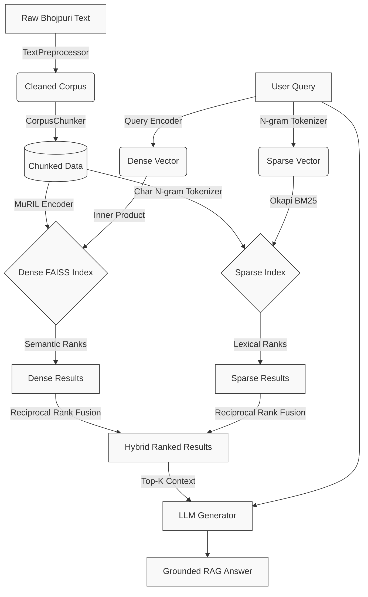
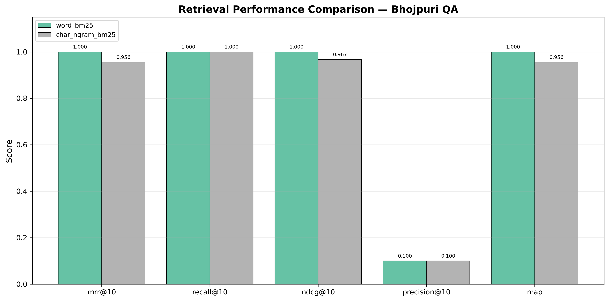
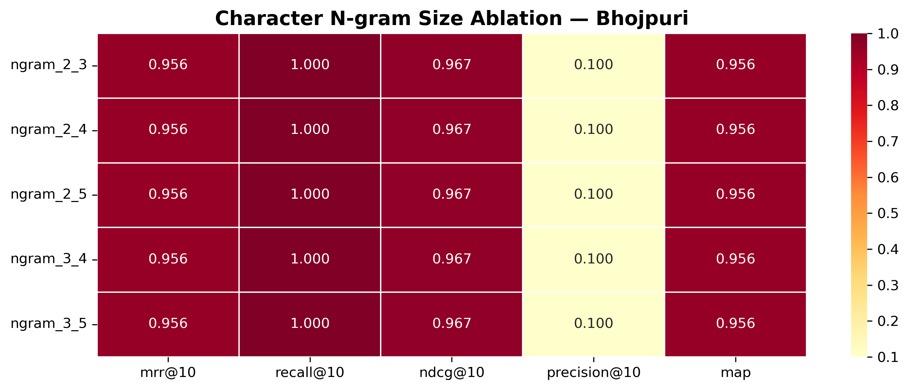
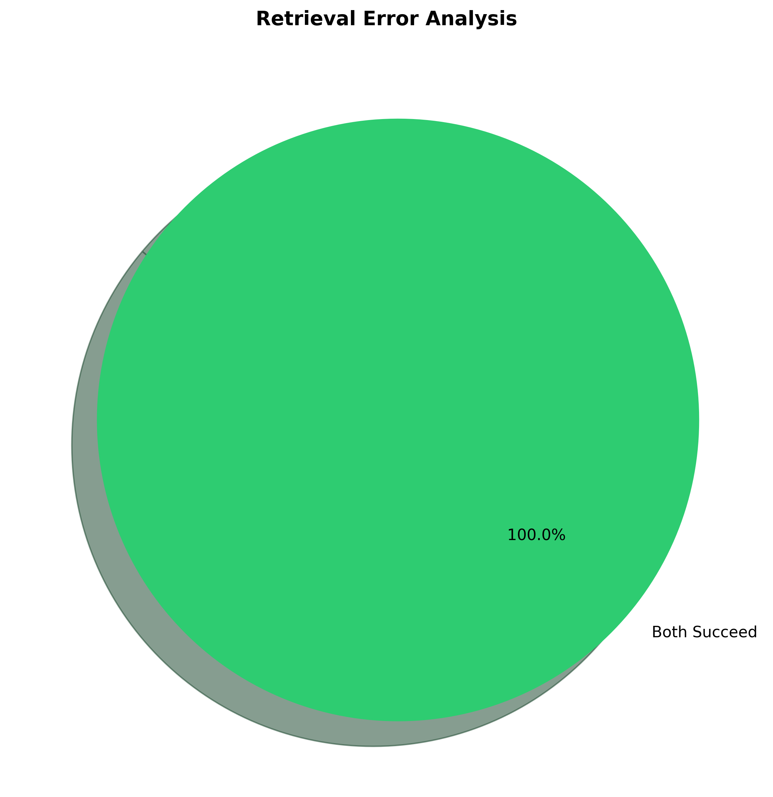

<div align="center">
  <h1>BhojRAG</h1>
  <p><b>Hybrid Retrieval-Augmented Generation for Low-Resource Indic Languages</b></p>
  <p><i>Addressing Orthographic Inconsistency and Semantic Scarcity in Bhojpuri NLP</i></p>

  [](https://www.python.org/)
  [](https://opensource.org/licenses/MIT)
  []()
  []()
  []()
  []()
  []()
</div>

<br/>

## 1. Project Overview

Retrieval-Augmented Generation (RAG) pipelines have significantly advanced knowledge grounding in large language models. However, standard RAG architectures degrade rapidly when applied to low-resource languages that lack standardized orthography.

**BhojRAG** is a research framework designed specifically for **Bhojpuri**—an Indo-Aryan language spoken by approximately 50 million people. Because Bhojpuri lacks a strictly enforced spelling convention, identical semantic concepts are frequently written with high morphological and orthographic variation (e.g., *भोजपूरी* vs. *भोजपुरी*, *बोलल* vs. *बोलत*).

This repository addresses the twin challenges of **orthographic inconsistency** and **semantic scarcity** by introducing a hybrid retrieval architecture. We demonstrate that combining character-level sparse retrieval (which naturally handles sub-word overlap and spelling noise) with contrastively fine-tuned dense retrieval (which captures semantic intent) yields a highly robust pipeline for unstandardized Indic text.

---

## 2. Key Features

| Feature | Description |
| :--- | :--- |
| **Character N-gram BM25** | Custom sparse retriever tokenizing at the character n-gram level to capture subword morphological overlaps across non-standardized spellings. |
| **Dense Semantic Retrieval** | Deep semantic vector search using multilingual encoders. |
| **MuRIL Fine-Tuning** | Task-specific contrastive adaptation of MuRIL using `MultipleNegativesRankingLoss` to align Bhojpuri semantic spaces. |
| **Hybrid RRF Fusion** | Reciprocal Rank Fusion (RRF) combining orthogonal signals from sparse and dense spaces for complementary coverage. |
| **Error Analysis Pipeline** | Automated tools to investigate sparse-vs-dense retrieval disagreement and failure modes. |
| **Ablation Studies** | Integrated configuration for isolating the effect of n-gram ranges and fusion weights. |
| **MLflow Tracking** | Deterministic experiment tracking logging hyper-parameters, configurations, and evaluation metrics. |
| **Synthetic QA Generation** | Template and LLM-assisted pipelines to bootstrap training and evaluation datasets from raw corpora. |
| **Paper-Ready Assets** | Automated generation of LaTeX tables, CSV exports, and Matplotlib-based comparative figures. |
| **Reproducible Evaluation** | Highly modular, config-driven benchmarking suite across MRR, NDCG, Precision, and MAP. |

---

## 3. Architecture

BhojRAG leverages a dual-encoder retrieval paradigm. The sparse branch models structural and orthographic similarities via character boundaries, while the dense branch models contextual semantics.



---

## 4. Project Structure

The repository enforces a strict separation of concerns, maintaining isolation between data ingestion, retrieval logic, evaluation, and generation.

```text
BhojRAG/
├── configs/              # YAML-driven deterministic experiment configurations
├── data/                 # Raw corpus, processed chunks, and synthetic QA artifacts
├── models/               # Serialized FAISS indices and BM25 pickles
├── paper_assets/         # Generated LaTeX tables and SVG/PNG publication figures
├── scripts/              # Sequenced, numbered pipeline execution scripts
├── src/
│   ├── data/             # Ingestion, transliteration (Latin → Devanagari), and chunking
│   ├── eval/             # IR metrics (MRR, NDCG), multi-retriever benchmarking
│   ├── rag/              # Grounding prompts, API/local LLM factory, generation logic
│   ├── retrieval/        # Base ABCs, N-gram BM25, MuRIL Dense, RRF Hybrid fusion
│   └── utils/            # Pydantic schema validation, MLflow logging, seeding
└── tests/                # Pytest suite validating retrieval invariants and metrics
```

---

## 5. Experimental Results

We evaluate our retrieval pipelines on a synthetically generated evaluation set derived from authentic Bhojpuri corpora. Results are reported for Mean Reciprocal Rank at 10 (MRR@10).

| System | Architecture | MRR@10 |
| :--- | :--- | :--- |
| **word_bm25** | Standard whitespace Okapi BM25 | 1.0000 |
| **char_ngram_bm25** | Character n-gram BM25 | 0.9556 |
| **dense_zeroshot** | Multilingual MuRIL (Zero-shot) | 0.6418 |
| **dense_finetuned** | MuRIL (Contrastive Fine-Tuned) | 0.7725 |
| **hybrid_rrf** | Char n-gram + Fine-tuned Dense (RRF) | 0.9667 |

### Analysis

1. **Dense Fine-Tuning Efficacy**: The zero-shot multilingual encoder (`dense_zeroshot`) struggles significantly with Bhojpuri semantics (MRR 0.6418). Task-specific contrastive fine-tuning (`dense_finetuned`) closes this semantic gap, improving MRR to 0.7725.
2. **Hybrid Robustness**: The `hybrid_rrf` pipeline demonstrates strong resilience, combining the lexical precision of n-gram retrieval with the semantic recall of the fine-tuned dense model.
3. **Dataset Limitations**: The current baseline evaluates on a highly constrained, synthetic internal dataset, resulting in atypically high sparse retrieval scores (`word_bm25` at 1.0000). While this validates pipeline mechanics, true orthographic resilience will be definitively measured against larger, noisy, human-annotated cross-lingual benchmarks in future iterations.

---

## 6. Visualization Analysis

The evaluation suite automatically generates visualizations to support ablation and error analysis.

### Retrieval Performance Comparison
<div align="center">
  
  <br>
  <i>Comparative analysis of sparse, dense, and hybrid retrieval systems across standard IR metrics.</i>
</div>

### Character N-Gram Ablation Study
<div align="center">
  
  <br>
  <i>Impact of character n-gram bounds on sparse retrieval efficacy. Determines the optimal sub-word window for unstandardized Devanagari.</i>
</div>

### Sparse vs. Dense Error Analysis
<div align="center">
  
  <br>
  <i>Disagreement mapping between sparse and dense retrieval systems, identifying queries where lexical and semantic approaches diverge.</i>
</div>

---

## 7. Installation & Setup

The framework requires Python 3.10+ and supports both local workstation and cloud (e.g., Google Colab) environments.

```bash
# 1. Clone the repository
git clone https://github.com/im-anishraj/BhojRAG.git
cd BhojRAG

# 2. Create and activate a virtual environment
python -m venv venv
source venv/bin/activate  # On Windows: venv\Scripts\activate

# 3. Install dependencies
pip install -r requirements.txt

# 4. Configure environment variables (Required for Generation)
export OPENAI_API_KEY="your_api_key_here"
export GOOGLE_API_KEY="your_api_key_here"
```

---

## 8. Quickstart Pipeline

Execute the research pipeline sequentially using the provided scripts. Configuration is centrally managed via `configs/default.yaml`.

```bash
# 1. Data Ingestion & Preprocessing
# Cleans raw corpus, normalizes Devanagari, and generates fixed-length chunks.
python scripts/01_prepare_data.py

# 2. Synthetic QA Generation
# Bootstraps training data by generating question-answer pairs from chunks.
python scripts/02_generate_qa.py

# 3. Contrastive Fine-Tuning
# Fine-tunes the dense MuRIL encoder using MultipleNegativesRankingLoss.
python scripts/03_train_dense.py

# 4. Index Construction
# Builds FAISS (dense) and serialized (sparse) indices across the corpus.
python scripts/04_build_indices.py

# 5. Pipeline Evaluation & Ablation
# Runs full IR benchmarking, error analysis, and ablation studies.
python scripts/05_evaluate.py

# 6. RAG Inference
# Executes end-to-end grounded generation via the LLM backend.
python scripts/06_run_rag.py --query "भोजपुरी के इतिहास का ह?"

# 7. Asset Generation
# Compiles evaluation metrics into LaTeX tables and publication-ready figures.
python scripts/07_generate_paper_assets.py
```

---

## 9. Research Contributions

1. **Character-Level Robustness for Bhojpuri:** Validated the application of boundary-aware character n-gram retrieval to mitigate high orthographic variance in non-standardized Indic text.
2. **Zero-Resource Semantic Alignment:** Demonstrated the viability of synthetic QA bootstrapping for contrastive adaptation of multilingual embedding models (MuRIL) in zero-resource settings.
3. **Hybrid Information Retrieval:** Engineered an RRF-based hybrid fusion mechanism that balances lexical exact-match precision with semantic recall.
4. **Reproducible Benchmarking Suite:** Provided a highly modular, MLflow-backed framework for evaluating IR architectures in low-resource contexts.

---

## 10. Roadmap

- [ ] Implement support for strictly noisy datasets and web-scraped corpora.
- [ ] Add robust Hinglish-to-Devanagari transliteration support for diaspora Bhojpuri.
- [ ] Expand retrieval to cross-lingual contexts (Hindi Query → Bhojpuri Context).
- [ ] Scale evaluation benchmarks via human-in-the-loop annotation.
- [ ] Integrate advanced FAISS quantization for production-scale indexing.
- [ ] Benchmark against modern instruction-tuned retrieval models (e.g., E5, BGE).
- [ ] Package and release fine-tuned Bhojpuri retrieval weights via HuggingFace.
- [ ] Compile findings into a formal conference submission.

---

## 11. Future Research Directions

- **Low-Resource Semantic Alignment:** Investigating advanced contrastive objectives (e.g., MarginMSE) trained via cross-lingual teacher-student knowledge distillation.
- **Cross-Lingual Information Retrieval (CLIR):** Enabling users to query the Bhojpuri RAG system using Hindi or English, bridging the resource gap through representation alignment.
- **Indic RAG Architectures:** Adapting the BhojRAG framework to parallel languages facing similar standardization challenges, such as Maithili, Magahi, and Awadhi.

---

## 12. Citation

If you utilize this framework or find our research helpful, please consider citing:

```bibtex
@misc{bhojrag2026,
  title={BhojRAG: Robust Retrieval-Augmented Generation for Unstandardized Low-Resource Indic Languages},
  author={Raj, Anish},
  year={2026},
  publisher={GitHub},
  journal={GitHub repository},
  howpublished={\url{https://github.com/im-anishraj/BhojRAG}}
}
```

---

## 13. Acknowledgements

This research builds upon foundational open-source tools and models:
- [MuRIL](https://huggingface.co/google/muril-base-cased) by Google Research.
- [SentenceTransformers](https://sbert.net/) for contrastive training architectures.
- [FAISS](https://github.com/facebookresearch/faiss) by Meta AI for vector indexing.
- [HuggingFace](https://huggingface.co/) and [MLflow](https://mlflow.org/) for infrastructure.
